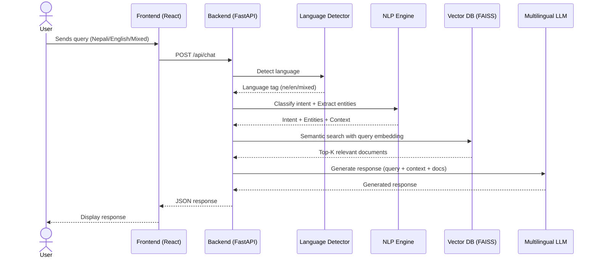
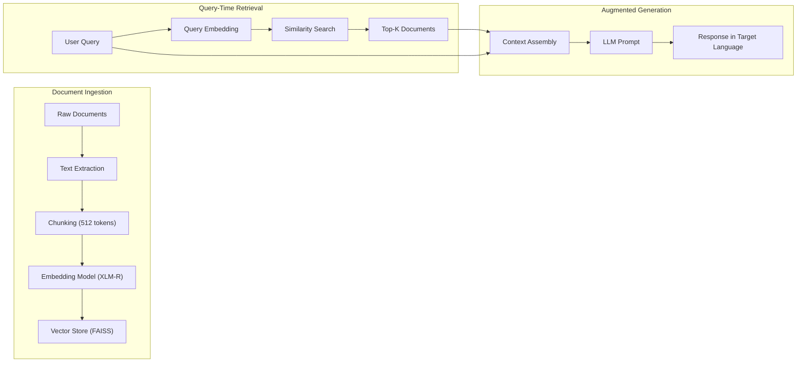
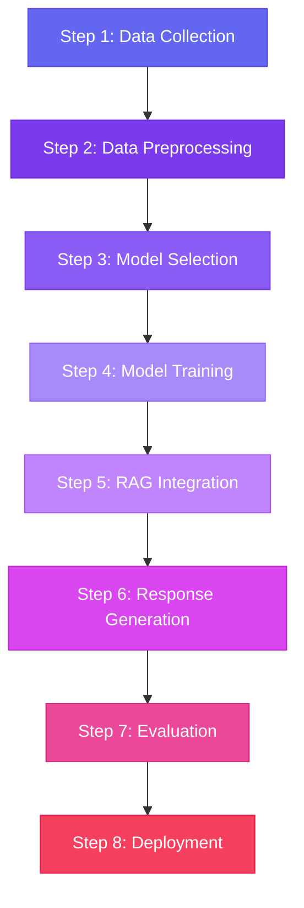
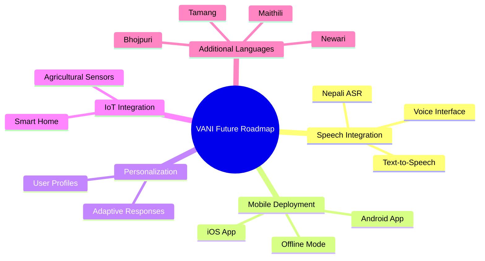

# VANI – Multilingual AI Virtual Assistant for Nepal

## 📘 Project Report

---

## Table of Contents

1. [Abstract](#1-abstract)
2. [Objectives](#2-objectives)
3. [Problem Statement](#3-problem-statement)
4. [Proposed Solution](#4-proposed-solution)
5. [System Architecture](#5-system-architecture)
6. [Methodology](#6-methodology)
7. [Tech Stack](#7-tech-stack)
8. [Key Features](#8-key-features)
9. [Evaluation Metrics](#9-evaluation-metrics)
10. [Applications](#10-applications)
11. [Challenges](#11-challenges)
12. [Future Scope](#12-future-scope)
13. [Conclusion](#13-conclusion)

---

## 1. Abstract

VANI is a multilingual conversational AI assistant designed specifically for Nepal, addressing the challenges of low-resource language processing. The system supports **Nepali**, **English**, and **code-mixed inputs**, enabling natural and context-aware human-computer interaction. It leverages a hybrid architecture combining multilingual natural language processing (NLP), intent recognition, and **Retrieval-Augmented Generation (RAG)** to provide accurate, relevant, and scalable responses.

The system is designed to function across multiple domains such as public services, education, and general assistance, making it adaptable for real-world deployment. By integrating vector-based semantic search with large language models, VANI overcomes limitations of traditional rule-based chatbots and contributes to advancing AI accessibility in underrepresented linguistic regions.

---

## 2. Objectives

### Primary Objectives

- Develop a multilingual conversational AI system for Nepali users
- Enable accurate understanding of code-mixed language inputs
- Implement context-aware dialogue management
- Integrate RAG for dynamic knowledge retrieval

### Secondary Objectives

- Address low-resource NLP challenges
- Build a scalable AI assistant architecture
- Support real-world applications (government, education, services)

---

## 3. Problem Statement

Most existing conversational AI systems are optimized for high-resource languages like English. Nepali, being a low-resource language, suffers from:

| Challenge | Description |
|-----------|-------------|
| **Limited Datasets** | Scarce annotated corpora for training NLP models |
| **Poor Model Performance** | Standard NLP models fail to generalize on Nepali text |
| **No Context-Aware Assistants** | Existing tools lack multi-turn dialogue understanding |
| **Code-Mixing Complexity** | Users frequently blend Nepali and English, confusing monolingual systems |

> **This creates a critical gap in accessible, intelligent digital assistants for Nepal.**

---

## 4. Proposed Solution

VANI introduces a **hybrid multilingual conversational framework** that:

- Processes Nepali, English, and mixed inputs seamlessly
- Uses multilingual transformer models for deep understanding
- Implements RAG architecture for dynamic knowledge retrieval
- Generates contextually relevant, natural-sounding responses

---

## 5. System Architecture

### 5.1 Complete System Architecture

```mermaid
graph TD

%% =========================
%% USER LAYER
%% =========================
A[User Interface<br/>(Web / Mobile / Voice)]

%% =========================
%% API LAYER
%% =========================
B[API Gateway / Backend Server<br/>(FastAPI / Node.js)]

%% =========================
%% PROCESSING LAYER
%% =========================
C[Language Detection & Normalization]
D[Intent Classification Model]
E[Named Entity Recognition (NER)]
F[Dialogue Manager<br/>(Context + Memory)]

%% =========================
%% RAG PIPELINE
%% =========================
G[Query Embedding Model]
H[Vector Database<br/>(FAISS / Pinecone)]
I[Document Store<br/>(FAQs / Govt Data)]
J[Retriever]
K[Context Builder]

%% =========================
%% GENERATION LAYER
%% =========================
L[Multilingual LLM<br/>(Response Generator)]

%% =========================
%% OUTPUT LAYER
%% =========================
M[Post-processing<br/>(Language Control)]
N[Response Output<br/>(Text / Speech)]

%% =========================
%% TRAINING PIPELINE
%% =========================
O[Dataset Collection<br/>(Nepali + Code-Mix)]
P[Data Preprocessing]
Q[Model Training / Fine-tuning]
R[Evaluation Metrics<br/>(F1, BLEU, Accuracy)]

%% =========================
%% FLOW CONNECTIONS
%% =========================

A --> B
B --> C
C --> D
C --> E
D --> F
E --> F

F --> G
G --> J
J --> H
H --> K
I --> H

K --> L
F --> L

L --> M
M --> N

%% =========================
%% TRAINING FLOW
%% =========================

O --> P --> Q --> R
Q --> D
Q --> E
Q --> G

%% =========================
%% STYLING
%% =========================

style A fill:#1e3a8a,color:#fff
style B fill:#2563eb,color:#fff

style C fill:#7c3aed,color:#fff
style D fill:#8b5cf6,color:#fff
style E fill:#a78bfa,color:#fff
style F fill:#c084fc,color:#fff

style G fill:#059669,color:#fff
style H fill:#10b981,color:#fff
style I fill:#34d399,color:#000
style J fill:#6ee7b7,color:#000
style K fill:#a7f3d0,color:#000

style L fill:#db2777,color:#fff
style M fill:#ec4899,color:#fff
style N fill:#f472b6,color:#000

style O fill:#92400e,color:#fff
style P fill:#b45309,color:#fff
style Q fill:#d97706,color:#fff
style R fill:#f59e0b,color:#000
```

### 5.2 End-to-End Workflow



### 5.3 RAG Pipeline Detail



---

## 6. Methodology

### Development Process



### Step 1: Data Collection

- Public service FAQs (government portals)
- Educational content (textbooks, online resources)
- Conversational samples (forums, social media)
- Code-mixed language corpora

### Step 2: Data Preprocessing

- Clean raw text (remove HTML tags, special characters)
- Remove noise and irrelevant content
- Handle code-mixing patterns
- Normalize spelling variations in Nepali text

### Step 3: Model Selection

| Model | Purpose | Language Support |
|-------|---------|-----------------|
| **XLM-RoBERTa** | Cross-lingual understanding | 100+ languages incl. Nepali |
| **IndicBERT** | Indic language specialization | South Asian languages |
| **mBERT** | Multilingual baseline | 104 languages |

### Step 4: Training

- **Intent Classification** – Categorize user queries into predefined intents
- **Named Entity Recognition** – Extract entities (names, dates, locations)
- **Dialogue State Tracking** – Maintain conversation context across turns

### Step 5: RAG Integration

- Convert knowledge-base documents into vector embeddings
- Store embeddings in FAISS / Pinecone vector database
- Implement semantic similarity search for retrieval

### Step 6: Response Generation

- Use multilingual LLM with retrieved context
- Generate responses in the user's preferred language
- Ensure cultural and linguistic appropriateness

---

## 7. Tech Stack

| Layer | Technology | Purpose |
|-------|-----------|---------|
| **Frontend** | React.js, Tailwind CSS | User interface & styling |
| **Backend** | FastAPI / Node.js | API server & business logic |
| **AI/ML** | Transformers (Hugging Face) | Model training & inference |
| **Models** | XLM-R, IndicBERT | Multilingual NLP |
| **Vector DB** | FAISS (local), Pinecone (cloud) | Semantic search & retrieval |
| **Deployment** | Docker, AWS / GCP | Containerization & hosting |
| **Version Control** | Git, GitHub | Source code management |

---

## 8. Key Features

| # | Feature | Description |
|---|---------|-------------|
| 1 | **Multilingual Support** | Native support for Nepali and English |
| 2 | **Code-Mixed Handling** | Understands blended Nepali-English queries |
| 3 | **Context Awareness** | Maintains conversation state across multiple turns |
| 4 | **RAG Responses** | Retrieves real-time knowledge for accurate answers |
| 5 | **Modular Architecture** | Each component is independently scalable |
| 6 | **Low Latency** | Optimized pipeline for fast response times |

---

## 9. Evaluation Metrics

| Metric | Description | Target |
|--------|-------------|--------|
| **Intent Accuracy** | Correct classification of user intents | >= 90% |
| **F1 Score (NER)** | Harmonic mean of precision and recall | >= 85% |
| **BLEU Score** | Response quality measurement | >= 0.65 |
| **Response Time** | End-to-end latency | < 2 seconds |
| **User Satisfaction** | Subjective rating from test users | >= 4.0/5.0 |

---

## 10. Applications

| Domain | Use Case |
|--------|----------|
| **Government Services** | Citizen query assistant for public service information |
| **Education** | Interactive learning chatbot for students |
| **Healthcare** | Basic health guidance and appointment assistance |
| **E-Commerce** | Customer support in Nepali for online platforms |
| **Rural Digital Access** | Bridging the digital divide for rural communities |

---

## 11. Challenges

| Challenge | Mitigation Strategy |
|-----------|-------------------|
| **Limited Nepali Datasets** | Data augmentation, synthetic data, transfer learning |
| **Code-Mixed Inputs** | Specialized tokenizers, language-tagging |
| **Context Consistency** | Dialogue state tracking with memory buffers |
| **RAG Latency** | ANN search, caching frequent queries |
| **Model Size** | Knowledge distillation, quantization |

---

## 12. Future Scope



---

## 13. Conclusion

VANI represents a significant step toward **democratizing AI for low-resource languages**. By combining multilingual NLP with retrieval-based intelligence, the system provides a scalable and practical solution for conversational AI in Nepal.

Its modular design allows adaptation across multiple domains — from government services to education and healthcare — making it a strong candidate for both **academic research** and **real-world deployment**.

---

> **Project:** VANI – Multilingual AI Virtual Assistant for Nepal  
> **Repository:** [GitHub](https://github.com/oyyPoodles/Vani---Multilingual-AI-Virtual-Assistant-for-Nepal)  
> **License:** MIT
